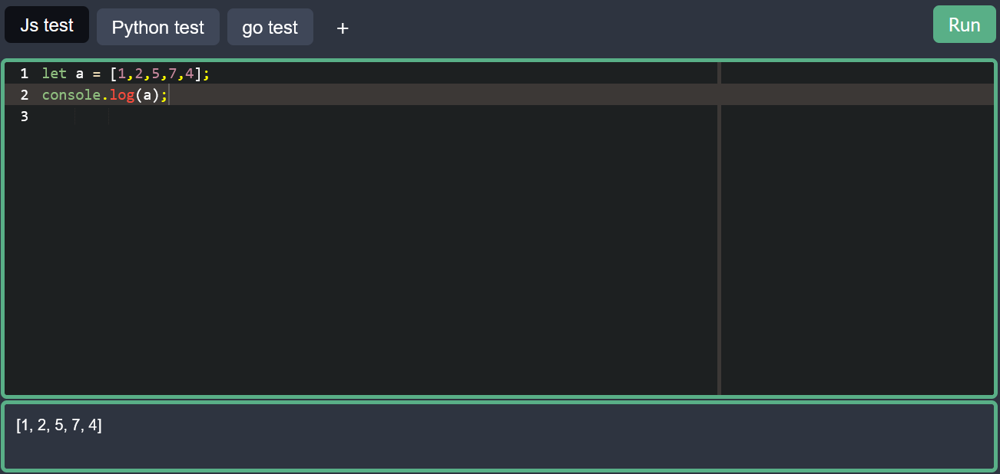

# COOLDE
JS/python (golang soon) interpreter in the frontend with the browser js interpreter and the Pyodide project
a good project for small testing of interview in those specefic languages 
 

---
Big thanks to the project [Ace Editor](https://ace.c9.io/)
and the [Pyodide](https://ace.c9.io/) project , we hope to see more use of WASM in the future
---

this only runs in the browser , python is not fully set up
if you want to contribute feel free to do so 

---
###TODO

- adding pipeline to autodeploy to heroku
- adding pipeline to autodeploy to Dockerhub
- find any other lang that can bu interpreted/compiled in clientside (thnx WASM again)
- 
---
SAVE POINT 2021 
